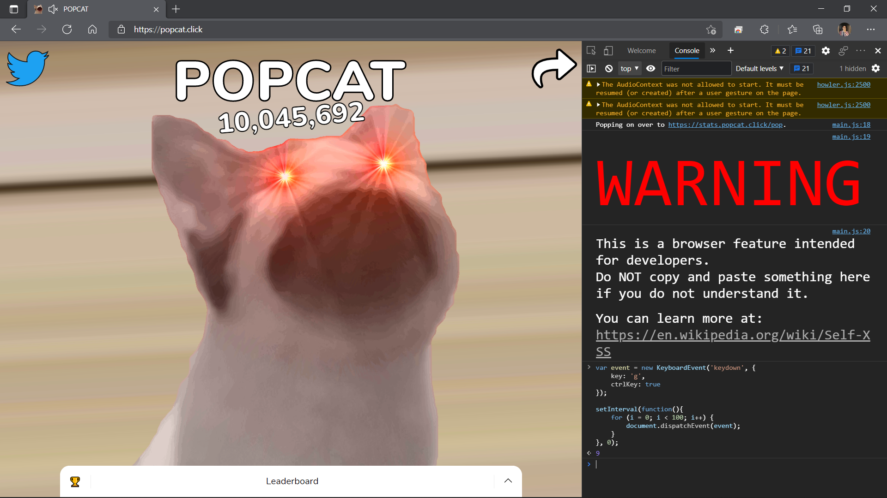

### Instruction :
1. Open <a href="https://popcat.click">https://popcat.click</a> <br>
2. Open console (F12) <br>
3. Copy code below & run <br>

### Code :
```
var event = new KeyboardEvent('keydown', {
	key: 'g',
	ctrlKey: true
});

setInterval(function(){
	for (i = 0; i < 100; i++) {
		document.dispatchEvent(event);
	}
}, 0);
```

### Screenshot :
[]()
